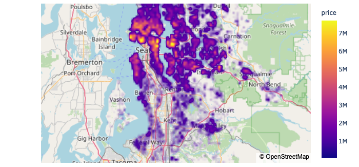
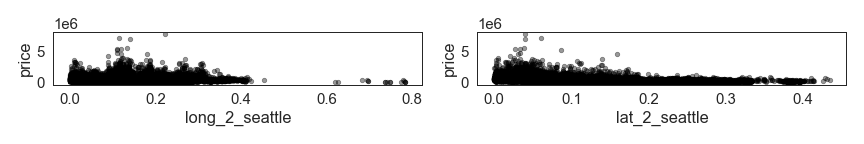

# House Price Prediction in King County, USA

This is my first small project at the Data S>cience bootcampt [neuefische](neuefische.de), Fall 2020. The main focus of the project is a Exploratory Data Analysis including Data Cleaning and Data Exploration. Some Feature Engineering has been done, and a small scale Linear Regression Model is fit to a train data set and then later tested on a test data set. 

The data set itself cofers roughly 20.000 data points, representing house sales between May 2014 and May 2015 in the King County area, close to and including Seatle. 

## Data Exploration

A few insights, more in the Juipyter Notebook: 

- `price` is directly proportional to `sqft_living`. Most  houses got a living area of 1000 to 5000 sqf
- a the median price of a house with basement is $100,000 greater than a house without basement
- Latitude influences the price. As the Seattle area has a great north-south stretch, prices tend to be lower father away from the center
- `sqft_living`, `soft_above` and `soft_basement` have a strong correlation and tend to overfit the model  - watch for multicollinearity. 
- houses with 3 bedrooms are most common in King County while houses with 1,7 bedrooms are very uncommon

When we look at the geolocation relative to the center of Seattle, we find that prices are high closer to the city, as illustrated in the following graphic. 

## Predicte Model

Single Linear Regression and Multivariate Linear Regression have been considered. Single Linear Regression yields correlations no greater than R-squared = 0.6, most features correlate with the price around R-squared = 0.4. 

For the Multivariate Linear Regression, 6 features have been considered, yielding a R-squared = of 0.651. 

To test the Multivariate Linear Regression Model, the data is split in a train and a test dataset. The performance of the model based on the Root Mean Squarred Error is as followed: 

- Train RMSE: 265622.8
- Test RMSE: 262672.4

## Files

The Jupyter Notebook includes all calculations and visualisations. A presentation hold at the bootcamp can be found as a PDF. 

## Future Work

Extended Documentation of the Process. More insights into Lat/Long. 